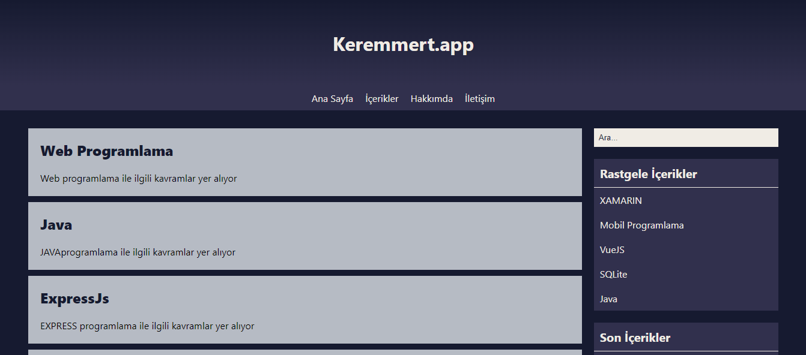

# Blog Website

* Eğer site "/site/" dizinine kurulmayacaksa sitenin kurulacağı dizinin **index.php("BASE_URL")** ve **public/js/searchContent.js("url")** değerlerini siteyi kuracağınız dizine göre değiştirmeniz gerekiyor. 
Örneğin kök dizine kurulum yapılacaksa **"/"** şeklinde olmalıdır.
* Admin sayfasına **"/admin"** ile erişebilirsiniz.(Kurulum kök dizine yapıldıysa)
* Admin giriş bilgileri
Email: **123456@admin.com** - Parola: **123456**
* CK Editör CDN ile dahil edildiği için internet bağlantısıyla kullanılabilmektedir.
